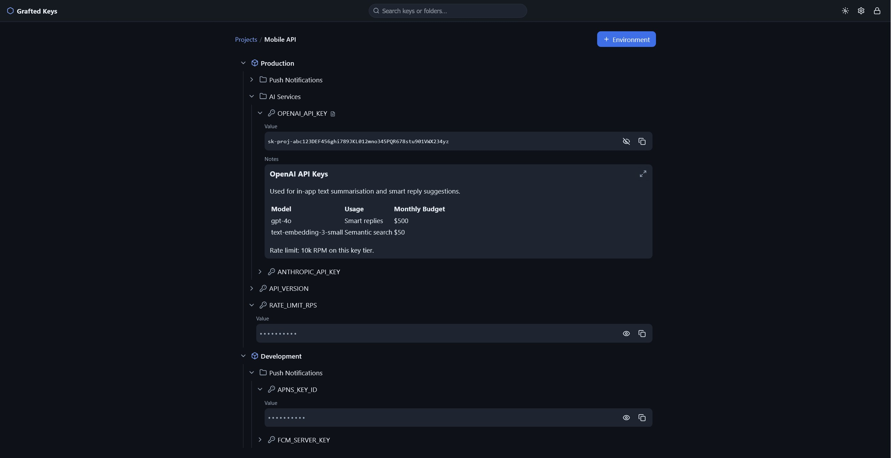
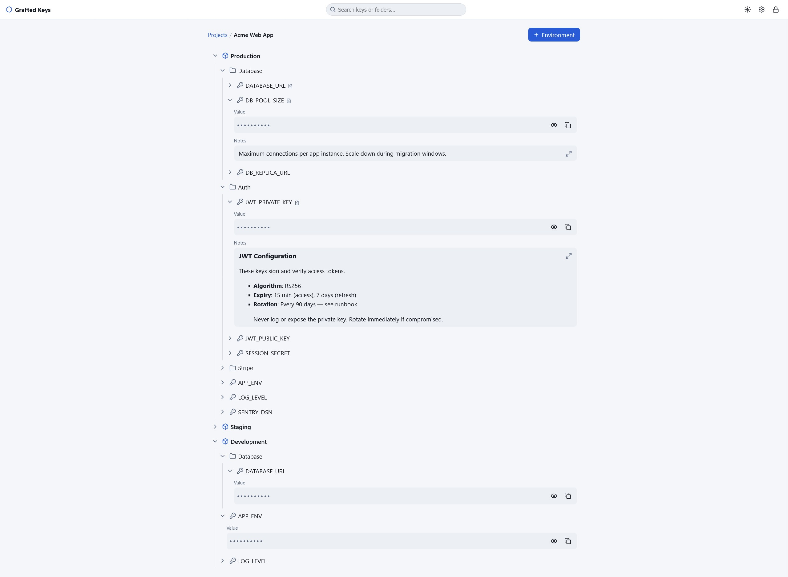

# Grafted Keys

A minimal, security-hardened, **zero-knowledge** secrets manager and backup
service you can self-host. One small Go binary, embedded UI, SQLite storage.
Designed to sit on a LAN and, if you want, behind a reverse proxy.

- **Zero-knowledge** - your master passphrase derives the encryption key
  (Argon2id). The server stores only ciphertext and never persists the key.
- **Tiny** - ~15–25 MB image on distroless, ~10–15 MB idle RAM.
- **Hardened** - strict CSP, CSRF, rate-limited login, optional TOTP, AAD-bound
  AES-256-GCM, read-only rootfs, non-root, dropped capabilities.
- **Organised** - Project → Environment → Folder → Secret (name, value,
  markdown notes), global search, dark/light, mobile-first UI.
- **Backups** - scheduled encrypted SQLite snapshots with retention.

> ⚠️ Zero-knowledge means **there is no passphrase recovery**. If you lose your
> master passphrase, the data is unrecoverable. Keep backups and remember it.

## Screenshots

 

<video src=".github/demo-darkmode.mp4" controls></video>

<video src=".github/demo-md.mp4" controls></video>

## Quick start (Docker Compose)

```bash
docker compose up -d --build
# open http://localhost:8080 and create your master passphrase
```

Put a TLS-terminating reverse proxy (Caddy, nginx, Traefik) in front if you
expose it beyond localhost, and set `GRAFTED_TRUST_PROXY=1` + `GRAFTED_HSTS=1`.

The container runs as the non-root uid `65532` on a read-only root filesystem.
Named volumes (the Compose default) inherit the right ownership automatically. If
you instead **bind-mount** host directories for `/data` and `/backups`, `chown`
them first: `sudo chown -R 65532:65532 ./data ./backups`.

### Plain-HTTP LAN (no TLS)

The session cookie is `Secure` by default (required for the `__Host-` prefix).
For a trusted LAN without TLS, set `GRAFTED_SECURE_COOKIE=0` - this drops the
cookie prefix and `SameSite` hardening, so only do it on a trusted network.

## Local development

```bash
make run        # serves :8080, data in ./data, SECURE_COOKIE off
make test       # unit tests
make build      # static binary -> ./grafted
```

Go 1.25+. No Node/JS build step - htmx is vendored and CSS/JS are hand-authored.

## Configuration (environment)

| Variable | Default | Notes |
|---|---|---|
| `GRAFTED_ADDR` | `:8080` | listen address |
| `GRAFTED_DATA_DIR` | `/data` | SQLite db lives here (`grafted.db`) |
| `GRAFTED_BACKUP_DIR` | `/backups` | snapshot destination |
| `GRAFTED_BACKUP_AT` | `03:00` | daily snapshot time `HH:MM` (empty disables) |
| `GRAFTED_BACKUP_KEEP` | `14` | snapshots to retain |
| `GRAFTED_SESSION_IDLE` | `30m` | auto-lock after inactivity |
| `GRAFTED_SESSION_MAX` | `12h` | absolute session lifetime |
| `GRAFTED_SECURE_COOKIE` | `1` | set `0` only for plain-HTTP LAN |
| `GRAFTED_TRUST_PROXY` | `0` | set `1` behind exactly one trusted proxy |
| `GRAFTED_HSTS` | `0` | set `1` only when served over HTTPS |
| `GRAFTED_ARGON_MEM_MIB` | `64` | KDF memory (floored at 19 MiB) |
| `GRAFTED_ARGON_TIME` | `3` | KDF iterations (floored at 2) |
| `GRAFTED_ARGON_PAR` | `min(4,CPUs)` | KDF parallelism |

## Backups & restore

Backups are consistent `VACUUM INTO` copies of the already-encrypted database,
so they are encrypted and can run while the vault is locked. To restore: stop
the container, replace `grafted.db` in the data volume with a snapshot, start,
and unlock with the **same passphrase that created that snapshot**.

## Security model

See [`docs/DESIGN.md`](docs/DESIGN.md) for the full threat model and crypto
design. In short: Argon2id wraps a random data key (DEK); every field is
AES-256-GCM encrypted with role-bound AAD; the DEK lives only in server RAM
while unlocked and is zeroized on lock/idle.

**Out of scope:** a fully compromised host while the vault is unlocked (the key
is necessarily in RAM then), and passphrase recovery. TOTP is an online gate,
not cryptographic 2FA - the passphrase alone decrypts data at rest.

### Known v1 limitations

- A session that auto-locks mid-edit redirects to unlock; in-progress form input
  in that request is not preserved.
- TOTP enrollment shows the secret/URI as text (no inline QR image, to keep
  `img-src 'self'`); use your authenticator's manual-key entry.

## License

[MIT](LICENSE) © 2025 Andrew

Third-party components (htmx, Go modules) are listed in
[THIRD\_PARTY\_LICENSES](THIRD_PARTY_LICENSES) with their respective licenses
(BSD-2-Clause, BSD-3-Clause, MIT, Apache-2.0 - all MIT-compatible).
